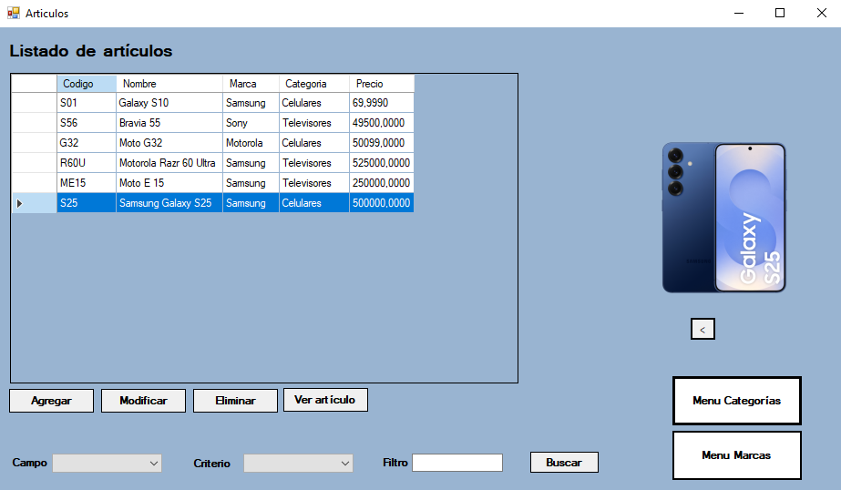
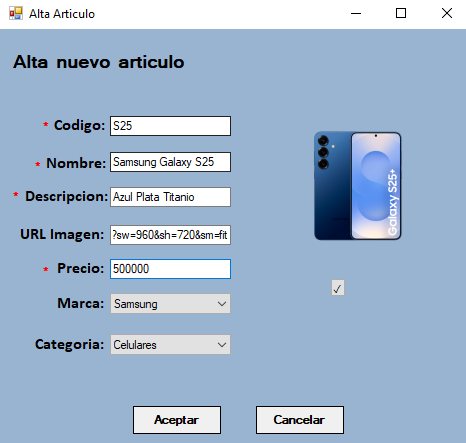
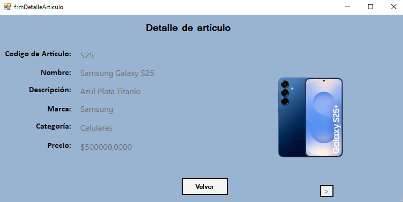
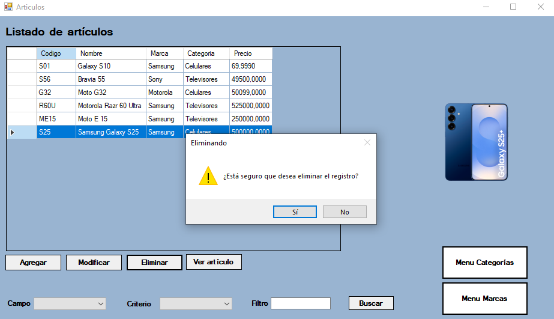
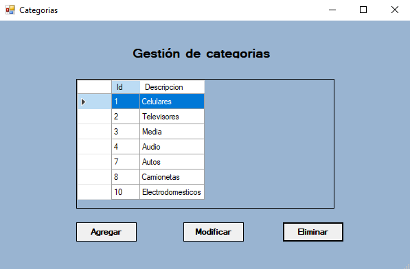
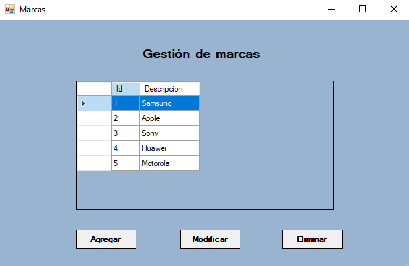

# Sistema de Catálogo de Artículos (Windows Forms - .NET Framework - ADO.NET)

Este proyecto es una **aplicación de escritorio en C# WinForms** que implementa un sistema de gestión de artículos, categorías y marcas.  
El objetivo es desarrollar una aplicación de escritorio con **ABM completo con conexión a base de datos SQL Server por medio de ADO.NET** (Alta, Baja, Modificación y eliminación) y uso de controles gráficos en Windows Forms.

---

## 📌 Funcionalidades principales

- **Gestión de artículos**
  - Alta de nuevos artículos (nombre, descripción, precio, categoría, marca e imagen).
  - Baja (eliminación) de artículos existentes.
  - Modificación de datos de artículos.
  - Visualización de la lista completa de artículos.

- **Gestión de categorías y marcas**
  - ABM de categorías.
  - ABM de marcas.
  - Asociación de artículos a categorías y marcas.

- **Interfaz amigable**
  - Listado en grilla (`DataGridView`).
  - Botones de acción (Agregar, Modificar, Eliminar, Detalle).
  - `PictureBox` para mostrar la imagen de cada artículo.
  - Validaciones para evitar errores de carga.

---

## 🖼️ Capturas de pantalla

---

## 🛠️ Tecnologías utilizadas

- **Lenguaje:** C#
- **Plataforma:** .NET Framework / WinForms
- **Acceso a datos:** **ADO.NET**
- **IDE:** Visual Studio

---

##  Cómo ejecutar

1. Clonar o descargar el repositorio.  
2. Abrir la solución `.sln` en **Visual Studio**.  
3. Compilar y ejecutar con **F5**.  

---

## 🎯 Objetivo del proyecto

- Practicar la implementación de **ABM** completo sobre múltiples entidades (artículos, categorías, marcas).
- Trabajar con **relaciones entre entidades** y **persistencia en base de datos**.
- Utilizar **ADO.NET** para el acceso a datos (conexiones, comandos, adaptadores y datasets).
- Utilizar **controles de WinForms** para una interfaz simple e intuitiva.
- Aprender a manejar **eventos**, **validaciones de datos** y **excepciones de base de datos**.

---

## 👥 Integrantes

- **Marcos Mazzitelli**  
- **Julieta Sanchez**

---

## 👨‍🏫 Profesores

- **Maximiliano Sar Fernandez**

---

